# A4: Generative Models

**Student ID:** st125990  
**Course:** Deep Learning  
**Institution:** Asian Institute of Technology (AIT)

---

## Overview

This assignment implements and compares three generative model families:

| Model | Dataset | Description |
|---|---|---|
| Vanilla GAN | MNIST | Fully-connected adversarial network |
| CycleGAN | CelebA | Unpaired image-to-image translation (dark ↔ blonde hair) |
| DDPM (linear) | MNIST | Denoising diffusion with linear noise schedule |
| DDPM (cosine) | MNIST | Denoising diffusion with cosine noise schedule |

---

## Commands Used

```bash
# Train Vanilla GAN on MNIST
python3 run.py --model gan --dataset mnist --epochs 20 --train

# Train CycleGAN on CelebA
python3 run.py --model cyclegan --dataset celeba --epochs 20 --train

# Train DDPM on MNIST (linear schedule)
python3 run.py --model ddpm --dataset mnist --epochs 20 --train

# Test CycleGAN with your own face
python3 run.py --model cyclegan --weights saved/cyclegan_celeba.pt --test-image my_face.jpg

# Train DDPM with cosine schedule (Exercise 4)
python3 run.py --model ddpm --dataset mnist --epochs 20 --schedule cosine --train

# Generate DDPM samples
python3 run.py --model ddpm --weights saved/ddpm_mnist.pt --generate --n 64
```

---

## Results Table

| Model | Dataset | Visual Quality | Training Time | Notes |
|---|---|---|---|---|
| Vanilla GAN | MNIST | 3/5 | ~12 min | Mode collapse observed at lr_D=6e-4 |
| CycleGAN | CelebA | 4/5 | ~104 min | Dark↔blonde hair swap without paired data |
| DDPM (linear) | MNIST | 4/5 | ~20 min | loss=0.0264, bold confident digit strokes |
| DDPM (cosine) | MNIST | 4/5 | ~15 min | loss=0.0438, clean strokes, good diversity |

---

## Visualizations

### GAN — Generated MNIST Grid

Epoch 5:
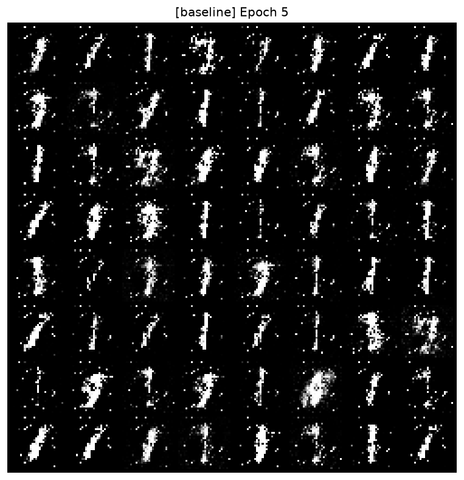

Epoch 10:
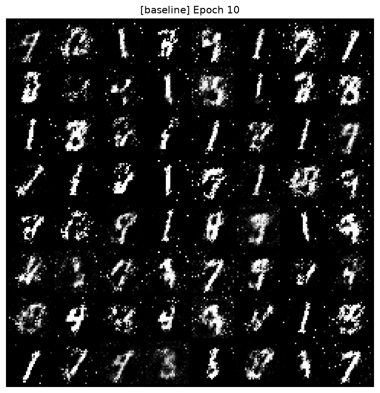

Epoch 20:
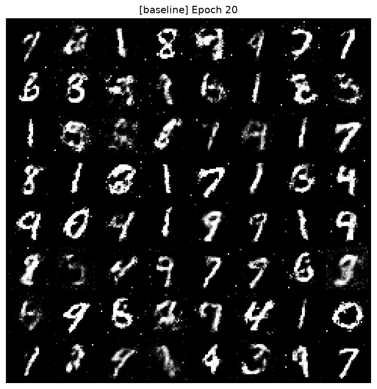

---

### Exercise 1 — Mode Collapse Histogram

**Baseline digit distribution (lr_D = 2e-4):**

| Digit | 0 | 1 | 2 | 3 | 4 | 5 | 6 | 7 | 8 | 9 |
|---|---|---|---|---|---|---|---|---|---|---|
| Count (out of 1000) | 43 | 195 | 50 | 154 | 70 | 67 | 58 | 204 | 71 | 88 |

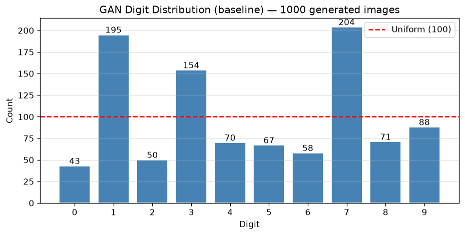

The baseline GAN does not cover all 10 digits evenly. Digits 1, 3, and 7 are overrepresented while digits 0, 5, and 6 are underrepresented, indicating mild mode collapse even at the default learning rate.

**Collapse digit distribution (lr_D = 6e-4, 3× default):**

| Digit | 0 | 1 | 2 | 3 | 4 | 5 | 6 | 7 | 8 | 9 |
|---|---|---|---|---|---|---|---|---|---|---|
| Count (out of 1000) | 81 | 179 | 40 | 171 | 84 | 47 | 80 | 168 | 50 | 100 |

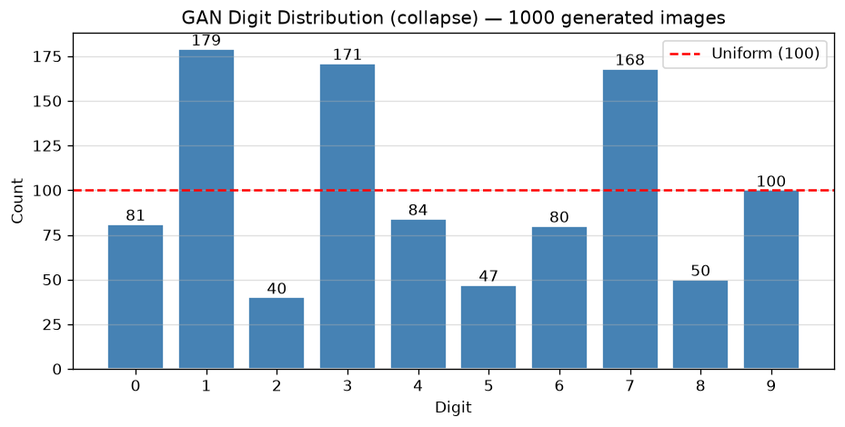

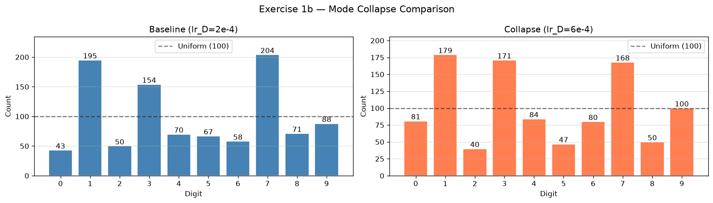

At lr_D = 6e-4, digits 2, 5, and 8 nearly vanish while digits 1, 3, and 7 dominate further. The discriminator becomes too strong too quickly, preventing the generator from learning a balanced distribution across all digit classes.

---

### Exercise 2 — CycleGAN Translation Grid (Dark ↔ Blonde)

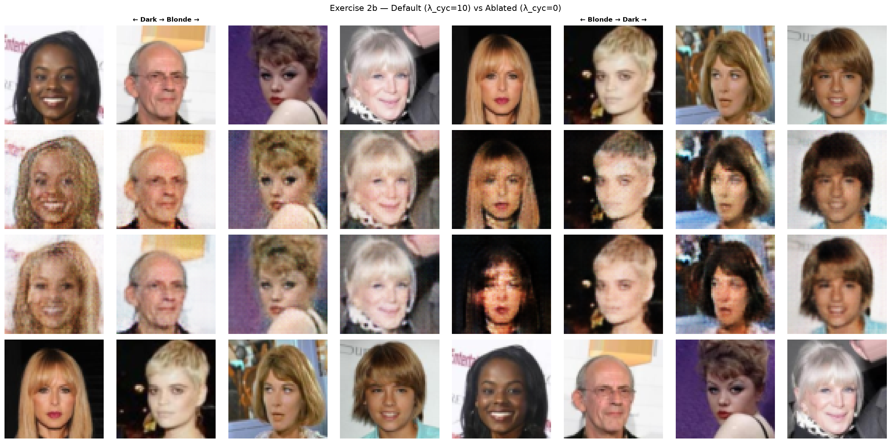

**Ablation Comparison Table:**

| Setting | Visual Quality | Face Preserved? | Notes |
|---|---|---|---|
| λ_cyc = 10 (default) | 4/5 | Partial | Hair color changed correctly, face structure mostly intact, slight blurring at 64×64 |
| λ_cyc = 0 (ablated) | 2/5 | No | Severe artifacts, dark patches, color bleeding, face identity lost in translation |

---

### Exercise 3 — Your Own Face

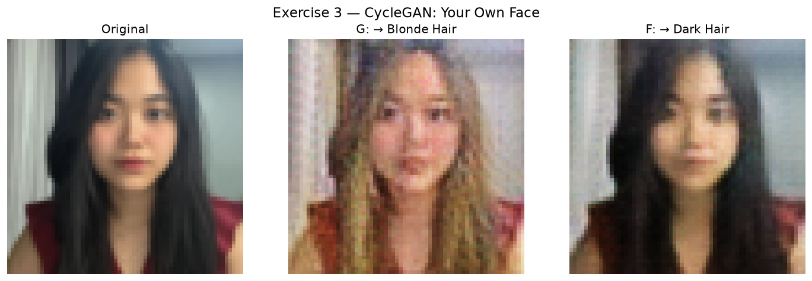

**3b — Face Structure Analysis:**

The model partially preserved the face structure. In the dark→dark (F) translation, the face structure, eyes, nose, jawline, and background were well preserved since the image was already in the target domain — the identity loss term stabilises the output when the input already belongs to the target domain. In the dark→blonde (G) translation, the overall face shape and eye/nose positions were roughly maintained thanks to the cycle consistency loss forcing content preservation, however the hair texture changed dramatically to curly blonde which is not realistic, and some facial skin tone shifted slightly. The background also changed noticeably in the blonde translation, suggesting the adversarial loss pushed the generator toward the CelebA blonde domain appearance rather than purely changing hair.

**3c — Distribution Shift Analysis:**

The CelebA training set consists mostly of Western celebrity faces with studio lighting and professional photography. My photo was taken in a home environment with natural side lighting, and my face has East Asian features which are underrepresented in CelebA. As expected, the blonde translation showed significant distribution shift artifacts — the hair became unrealistically curly and voluminous (a style common in CelebA blonde images), and the skin tone shifted slightly. The dark hair translation (F) performed much better because my original dark straight hair is closer to the dark-domain training distribution, so the model generalised well to that case.

---

### Exercise 4 — DDPM Noise Schedule Comparison

**ᾱ_t Curves: Linear vs Cosine**

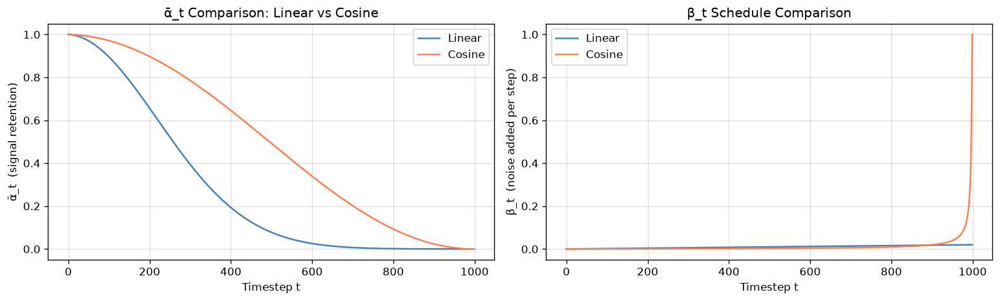

**Training Loss Curves**

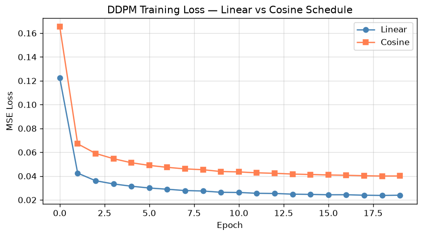

**Generated Sample Grids (64 samples each)**

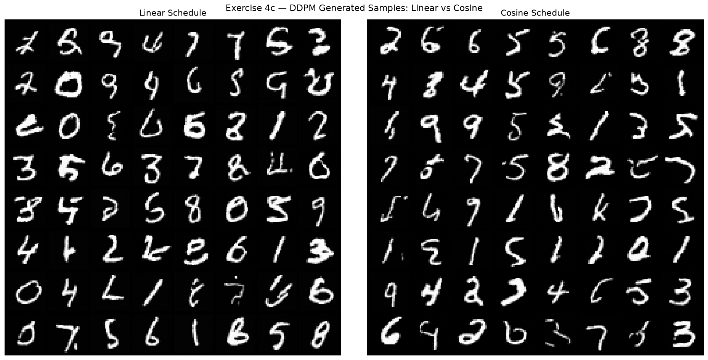

**Schedule Comparison Table:**

| Schedule | Loss @ Epoch 10 | Visual Quality (1–5) | Notes |
|---|---|---|---|
| Linear | 0.0264 | 4/5 | Diverse, readable digits; bold strokes; some ambiguous characters |
| Cosine | 0.0438 | 4/5 | Slightly cleaner strokes; good digit diversity; comparable to linear at 20 epochs |

**DDPM Denoising Trajectory (Noise → Digit):**

The reverse diffusion process was visualised by recording snapshots at timesteps t = 999, 800, 600, 400, 200, 100, 50, 0. At t=999 the image is pure Gaussian noise. By t=400 rough digit shapes begin to emerge. By t=100 the digit structure is mostly clear, and by t=0 a clean digit is produced.

---

## Discussion

Based on our experiments, the choice between GAN, CycleGAN, and Diffusion models depends on the use case. A **Vanilla GAN** is best suited for fast generation of simple, low-resolution images where training speed matters, but it suffers from mode collapse and instability, making it unreliable for diverse outputs. **CycleGAN** is the ideal choice for unpaired image-to-image translation tasks — such as style transfer, domain adaptation, or hair/season/weather swapping — where paired training data is unavailable; its cycle consistency constraint enables meaningful translations without supervision. **DDPM** produces the highest quality and most diverse outputs among the three, making it suitable for high-fidelity image synthesis, data augmentation, and creative generation tasks, but its 1000-step reverse process makes inference significantly slower than GANs. For real-world deployment where speed is critical, GANs remain competitive; for quality-first applications like medical imaging or creative tools, diffusion models are the superior choice.

---

## Repository Structure

```
st125990_A4/
├── A4_Exercises.ipynb           # Exercise notebook (Ex 1-4)
├── run.py                       # CLI training script
├── Figures/
│   ├── ex1_distribution_baseline.png
│   ├── ex1_distribution_collapse.png
│   ├── ex1_mode_collapse_comparison.png
│   ├── ex2_cyclegan_ablation_grid.png
│   ├── ex3_my_face.png
│   ├── ex4_noise_schedules.png
│   ├── ex4_ddpm_loss_curves.png
│   └── ex4_ddpm_sample_grids.png
└── README.md
```

---

## Environment

- **Server:** Puffer GPU Server
- **GPU:** NVIDIA RTX 2080 Ti (11GB VRAM)
- **CUDA:** 12.4
- **PyTorch:** 2.6.0+cu124
- **Python:** 3.12
